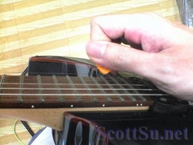
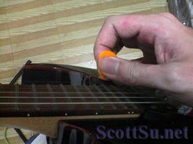

\[lwptoc\]

彈吉他的人，經常會使用Pick彈片撥弦，因此Pick的拿法，從一開始的有固定的基本姿勢，到後來有許多老師都認為只要拿的舒服就好，不太在意初學者要怎麼拿Pick。

#### 一般彈片拿法

\* 一般拿法 \*

其實書上所教的一般拿法，應該也是經過前人體會，是最方便彈奏的一種方法，所以如果以那種基本姿勢來彈撥，你也覺得很舒服，那就用那種方式吧～

#### 拿法的考慮因素

除了姿勢以舒服為主外，另外一個可以考慮的因素就是音色。

我本身一開始拿的姿勢就和一般的不一樣，也是我自己拿的覺得順手舒服的姿勢，後來我發現到我和別人的姿勢不一樣時，曾經開始試圖調整，希望能使用「正確的」姿勢來演奏，可能可以在技巧上更得心應手。

一開始我直接照一般人的基本拿法練習演奏時，發現不順手之外，聲音也變得不好聽，Pick撥弦的雜音明顯，而且削弱了聲音的飽和度和顆粒度，於是我先恢復成我原先自己的拿法，並開始慢慢旋轉pick的方向，讓它的面和弦是慢慢互相平行，果然越平行時，得到的音色顆粒會越明顯，越飽滿好聽，摩擦的雜音也越來越小，但是相對的，也越來越難順暢的連續撥弦。

這算是我從沒想到過的發現，以前看書或是老師也都沒有提到過。

於是我在慢慢調整之餘，找到了個可以兼具好撥和音色清楚，也延伸了我原先舒服的拿法，從此就是拿這樣的姿勢來練習與演奏，在音色上也就有和別人不同的辨別度了。

如果你也在彈吉他的話，尤其是電吉它，我想也可以思考一下這樣的問題喔～

\* 我的拿法 \*

自學的朋友，除了pick拿法外，還可以參考[這篇](https://tw.scottsu.net/%e8%87%aa%e5%ad%b8%e5%90%89%e4%bb%96%e7%9a%843%e5%80%8b%e9%87%8d%e9%bb%9e/ "自學吉他的 3 個重點")瞭解一些需要注意的事項。

➤ 更詳盡的入門教學，請參考選購針對無基礎初學者設計的教材「[吉他入門一本就上手](https://www.books.com.tw/products/0010785139?loc=P_0002_034)」。
