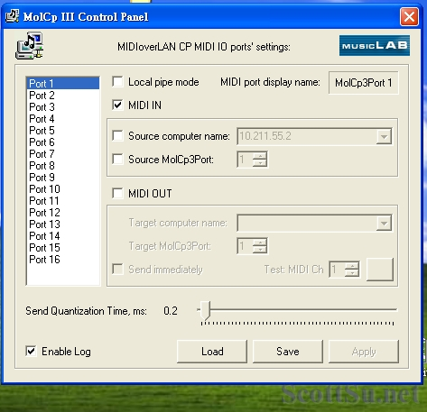
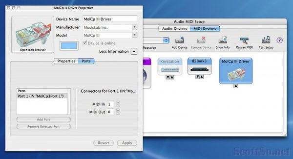

話說上一篇提到[怪獸級的音樂工作室](https://tw.scottsu.net/%e9%a9%9a%e4%ba%ba%e7%9a%84%e9%9f%b3%e6%a8%82%e5%b7%a5%e4%bd%9c%e5%ae%a4/)，開啟了我對電腦串連做音樂的一些興趣，於是先找了似乎容易上手的[MIDIoverLAN](http://www.musiclab.com/)軟體做測試，結果還是遇到許多問題，在我不斷的透過Google大神Surfing on the Internet後，總算有些概念上的了解，而且，蠻少中文站在討論這種問題，頓時讓我的English也有些進步，哈哈。

**1\. Why MIDIoverLAN？**

In fact, 還有其他的MIDI串連軟體可用，可是由於我是要跨平台，就是Mac和PC連接，據了解只有MIDIoverLAN有這本事，所以只好用它囉！如果是Mac to Mac，基本上Mac就已經有內建可以通過網路互連MIDI訊號的程式了，Mac連這需求都想到並準備好了，真是厲害。MIDIoverLAN，當然是要錢的，不過它有14天的試用版，功能全開，挺方便的，付費後還可以增加串連的電腦數。我嗎？當然是先用試用版。

**2\. How to Link？**

Yes, good question. Let's talk about it.

如果你是PC to PC，只要下載MIDIoverLAN後，分別裝在兩台PC上，打開程式後，主電腦（編曲用）將MIDI OUT的部份打勾，表示將由此電腦送出MIDI訊號，在Target Computer Name中輸入另一台電腦的IP位址，點選Apply，主電腦就算設定完成。

副電腦（專跑音色庫）一樣打開程式後將MIDI IN的部份打勾，其他通通不用輸入，點選Apply，這樣只要網路中有電腦對它發送MIDI訊號，它都會接收進來，副電腦也設定完成。

接著主電腦打開編曲軟體比如Nuendo，開啟MIDI軌，將該軌Output設成MolCP的選項；副電腦打開音色庫，將音色庫的MIDI input設定設成一樣是MolCP的選項，此時你從主電腦的Nuendo播放或彈奏MIDI訊號，應該就可以聽到副電腦發出的聲音了。用Logic的話請開啟External MIDI track，然後一樣在Port的部份選MolCP的選項，如果沒有出現，就是下面要講的問題。

如果你是要Mac to PC或是PC to Mac，基本上設定都是一樣，只是Mac會有一個問題，就是可能你在安裝完，第一次設定後，MIDIoverLAN就無法再進行設定上的修改，即使打開程式修改後，畫面上看起來都是對的，但它就是無法連接。這問題搞了我好久，我去官方討論區也看到很多人有遇到，不過有些解決方式很繁複，會讓你看起來像個笨蛋一樣還不見得有效，廠商看起來也都不太回應，挺機車的。

後來經過我反覆研究，終於發現，原來程式在Mac中設定完後，它的Driver，就像當掉了一樣動也不能動；你可以在「工具程式」中的「音訊MIDI設定」中看到，第一次設MIDI In的話，它的Driver就一直是「IN」的Driver，你要再改為Out，就沒辦法了。還好我也研究出一個方法，比笨蛋解決法還不像笨蛋多了，而且也不會複雜。方法如下：

- 先將MIDIoverLAN程式移除。（它說明檔有移除方式，不要笨笨的自己砍檔耶～）
- 重開機後，再到「工具程式」中的「音訊MIDI設定」把它變成問號的Driver移除掉。
- 重安裝MIDIoverLAN，然後再第一次設定時小心設定成你要的，完畢。

這樣就比其他人的方法簡單多了，最重要是第二步不能漏掉～

**3\. What should I notice？**

的確有些小部份要注意，否則你就會不斷的浪費時間卻找不出失敗原因。

- 要用網路線，不要用無線。雖然它的Mac版安裝後會有無線選項可以打勾，可是我測過，沒用。但國外好像有人可以，所以如果你想試，先確定有線的部份沒問題再測試吧，不過副電腦的部份倒是可以無線。
- 無法用虛擬電腦連接。知道什麼是虛擬電腦吧？

就這樣，至於Audio訊號我想就不用我說了，應該很好解決，Over。

\* 相關資訊連結： [http://www.soundonsound.com/sos/mar07/articles/dpworkshop\_0307.htm](http://www.soundonsound.com/sos/mar07/articles/dpworkshop_0307.htm) [http://emusician.com/mag/emusic\_midi\_lanlubbers/](http://emusician.com/mag/emusic_midi_lanlubbers/) [http://community.sonikmatter.com/forums/index.php?showtopic=24645](http://community.sonikmatter.com/forums/index.php?showtopic=24645) [http://discussions.apple.com/thread.jspa?threadID=1109473](http://discussions.apple.com/thread.jspa?threadID=1109473)
