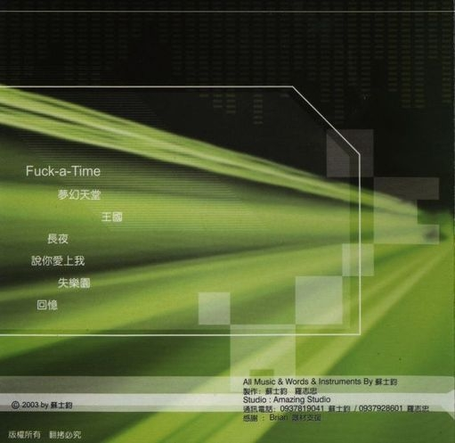

**音樂紀錄：**

> 曲/編曲/演奏：不拘時
> 
> 混音/後製：羅哥
> 
> Ibanez RG2020X + Johnson J-Station
> 
> Reason 1.0

這也是7.8年前的作品，是一首吉他演奏曲，因為自己是吉他手，所以也希望能有以自己為主角的音樂能紀錄一下；而因為我喜歡Funk，所以這首音樂創作就以Funk為主要元素摟。

其實，幾乎那張專輯所有的歌吉他間奏部份都還不短啦~ 哈哈~ 這是吉他手的壞習慣~

Funk輕快的節奏應該是很容易讓人入耳，所以就把它放在專輯的第一首開場。而當時在印刷和壓片中還有個小插曲，就是不知道是設計者還是印刷廠把曲名給印錯了，變成了 "Fuck\-a-time" :mrgreen: ，要說風格有合就算了，但是不合呀！只好自己去買轉印貼紙把它貼呈正確的字，後來還是懶了，現在只要有人要我還要先解釋說那個是印錯了，免得嚇到人呀！您說是嗎？ :lol:

