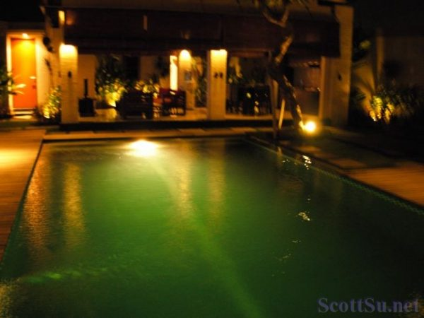

[Yahoo手機平台下載](http://www.e7play.com/v2/DownloadYahoo.aspx?typenon=4&y=1&auto_no=75524) （可以直接寄到手機喔！）

**\*來電答鈴**：音樂代碼 620795 （[看如何設定](http://yahoo2.e7play.com/rbt/rbt_download.aspx?rbtcode=620795)）

這首短音樂也放了段時間了，長度正好也可以用作鈴聲，是一首特殊風味的曲子，大致上在描述叢林中有點危機四伏的感覺，主要用簡單的民族樂器來演奏，鈴聲用這個，會有點緊張感，可能會嚇到人吧！ :mrgreen:
