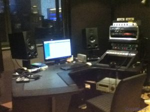
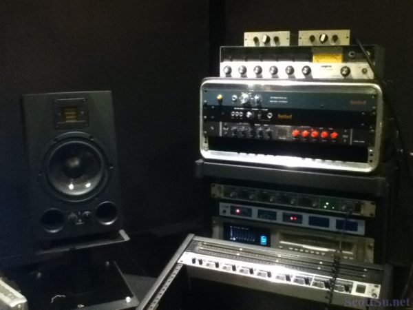
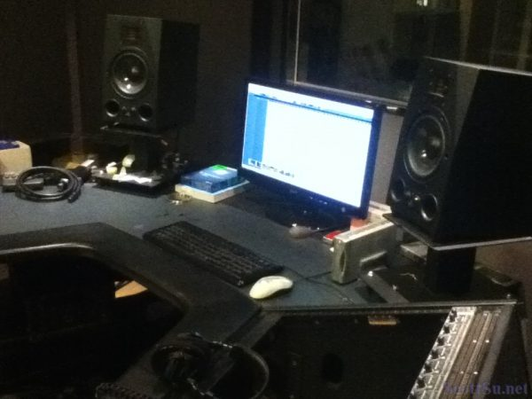
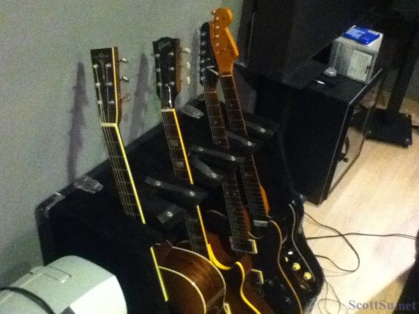
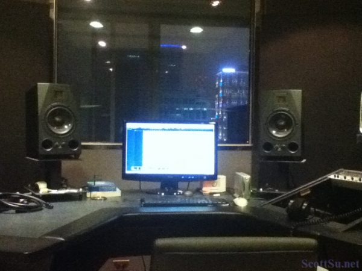

個人的音樂創作專輯終於進入了最後階段，不拘時帶著自己的作品，到了Mafia音樂工作室找好友小葛老師來進行討論以及處理，拍了段花絮，剛好也可以讓大家稍微聽到些專輯的音樂片段！

因為後製的Mastering處理，一定要在適合監聽的環境，並且有一對好的監聽喇叭才容易完成這個重要的工作，當然，人的操作也是很重要！不拘時真的相當感謝小葛老師呢！Mastering處理需要些時間，接下來不拘時要去處理其他像是封面、文字、印刷等等的行政事務了，然後會再把相關影片陸續貼上來，有興趣了解的朋友可以透過影片跟我跑流程喔！ :grin:

##  影片

放著音樂作品邊聽邊討論，大家也聽聽看囉！

https://www.youtube.com/watch?v=3\_VHqM2F9Ts

##  Mafia音樂工作室

小葛老師也相當阿沙力，直接就願意讓不拘時來拍些相片影片做紀錄，下面就貼幾張工作室的照片給大家看看吧！

監聽喇叭是目前正夯的Adam A7X，酷炫！

Outboard板上有空一大片，因為機器暫時拆到旁邊放囉！

好幾把吉他在旁邊，小葛老師其實是吉他彈很棒的吉他高手喔！

隔著2片窗看出去，視野不錯，夜景也很好！
