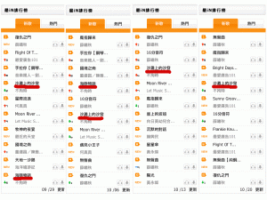

上次的3首曲子進到iNmusic演奏類新曲榜後，持續的進行追蹤，從9/1到10/20，慢慢的，一首首的掉出了Top 10的榜外，最後一首“沙灘上的沙發“在第8週後，也被擠出了榜外。

大概的統計了一下，目前為止：

“**[沙灘上的沙發](http://scottsu.net/products/sofa-on-the-beach)**“ 入榜 8 週

“**[海豚物語](http://scottsu.net/products/the-story-of-dolphin)**“ 入榜 6 週

“**[女孩跳舞](http://scottsu.net/products/dancing-dancing-girl)**“ 入榜 4 週

入榜的8週裡，9/8的成績是最好的，總共3首曲子進到前5名！真是相當開心啊！雖然沒有站上第一名過，但是不拘時已經相當感謝了！想聽聽看3首曲子的朋友，可以直接點上方連結來聽聽看～

至於[其他的專輯曲目](http://scottsu.net/music/albums)，也歡迎大家聽聽喔！

**\*[iNmusic 合法音樂下載平台](http://www.inmusic.com.tw/in/pd/album_list.aspx?aid=57838)**
