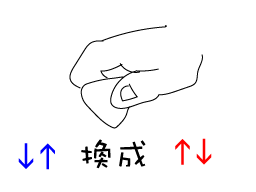

在教學的生涯裡，其實蠻常遇到學生有拍子上的問題。一般來說，拍子不穩不一定是初學者的專利，尤其對於自學樂器的人來說，有不少在一開始就沒有注意到練習需要對拍子，而不斷的用著「自由拍」來練習和彈奏歌曲，久而久之，就養成了錯誤的拍感以及節奏感，輕則彈奏時無法對鼓聲或節拍器，重則每個音都忽快忽慢，掉拍趕拍樣樣來。

如果你意識到了自己有這樣拍子不穩的問題，卻始終不知道怎麼解決，節拍器開下去，怎麼努力要對拍子就是對不到，那麼你可以試試看以下三個步驟。

## 用嘴巴數拍子，確認是否自身拍子不穩

用嘴巴數拍子的用意，是因為嘴巴出聲是最快最直接的，距離耳朵和大腦最近，比較不會被肢體動作影響，所以它幾乎可以代表你本身的拍感有沒有問題。那麼如果你用嘴巴數拍子時，可以對到拍子，也就是你的聲音可以跟節拍器的聲音重疊到，那就恭喜了，你本身的拍感應該沒有問題，可以進到下一步了。如果嘴巴數拍子也數不準，或是你聽不出來自己準不準，那你應該需要找老師現場協助你，幫你聽聽並且看看你哪裡需要解決；如果不知道找哪位老師，你也可以[找我上課](https://tw.scottsu.net/guitar-class-%e5%90%89%e4%bb%96%e6%95%99%e5%ad%b8/)來協助你，遠端進行也可以喔。

## 用手打拍子，確認是否手部動作拍子不穩

既然不是本身的拍感問題，那再來就確認看看用手簡單地打拍子會不會有問題。我們可以先試試單手，左手和右手都分別打拍子看看，接著再一左一右，以及一右一左的順序來打。這是用來訓練左右手的動作都可以掌握到拍點的練習。如果這些都沒問題，也可以進到下一步了。

## 對拍子彈奏，確認是否撥弦動作拍子不穩

用pick下上撥弦時，如果發現到往上撥的音符容易對不到拍子，那就反過來撥弦，變成先上再下撥弦，這樣對上撥的動作掌握會有所幫助，等到上下沒問題後，再改回下上，通常這樣彈奏上的pick對拍子就會穩很多。

<figure>

<figcaption>

把撥弦動作反過來

</figcaption>

</figure>

## 其他撇步

如果你覺得自己的拍感本身就是不好，那麼試試先放著節拍器，然後讓身體**對著拍子自然的律動**，前後或是左右搖晃，在放鬆的狀態下來進行。只要可以對著拍子自然律動身體，相信拍感就可以培養的越來越好。不過最重要的，不管是哪一種方法，都要多練習才會有用喔！

工商一下，[吉他編曲超訓練](https://goo.gl/ci6LPe)線上課程目前內容繼續優化中，歡迎前往了解課程內容，有需要諮詢也可以到[我的FB](https://www.facebook.com/scottmusic)留言喔！
